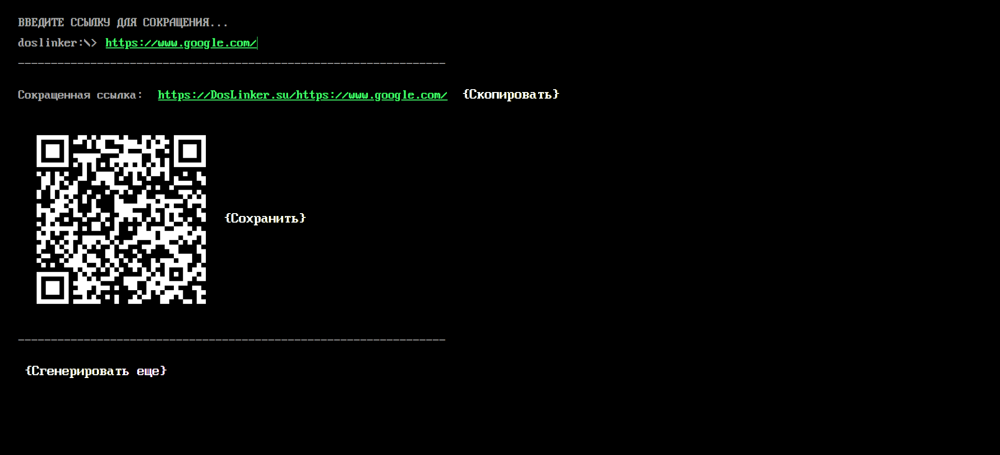

# MSDOS-like link shortener

# About 
This is client side of [**MSDOS link shortener**](https://doslinker.vercel.app/linkshorter) app. This app is designed to make **links** easy to read and paste it into other sites.

# Client side Technology Stack 
1. TypeScript (4.9.5)
2. Lodash (4.17.21)
3. React (18.2.0)
4. Redux (4.2.1)
5. Axios (1.3.4)

# Implemented functionality
## ***Done :***
1. [X] ****Links abbrevation***
2. [X] ***Validating an incoming link***
3. [X] ****Generating QR based on the link***

**Just an imitation on the client side (no interaction with the server)*
## ***Expected :***
1. [ ] ***Configuring interaction with the server API.*** *(There is no server side yet)*
2. [ ] *Interface development for mobile devices.*
3. [ ] *Translating the interface into English*

# Server side
The server part, and the API to interact with it is written by [spaceosint](https://github.com/spaceosint)*(github profile link)*