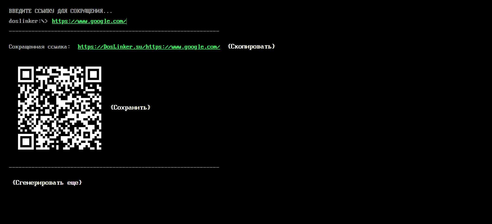

# MSDOS-like link shortener

# About 
This is client-side of [**MSDOS link shortener**]() app. This app is designed to make **links** easy to read and paste it into other sites.

# Client-side Technology Stack 
1. JS (ES6) 
2. React (18.2.0)
3. Redux (4.2.1)
4. React-bootstrap (2.7.0) (*using Bootstrap grid*)
5. Axios (1.3.2) (*REST API*)

# Implemented functionality
## ***Done :***
1. [X] ***Links abbrevation;***
2. [X] ***Generating QR based on the link;***
3. [X] ***Validating an incoming link;***
## ***Expected :***
4. [ ] ***Configuring interaction with the server API.***
5. [ ] *Interface development for mobile devices.*
6. [ ] *Translating the interface into English*

# Server-side
The server part, and the API to interact with it is written by [spaceosint](https://github.com/spaceosint)*(github profile link)*